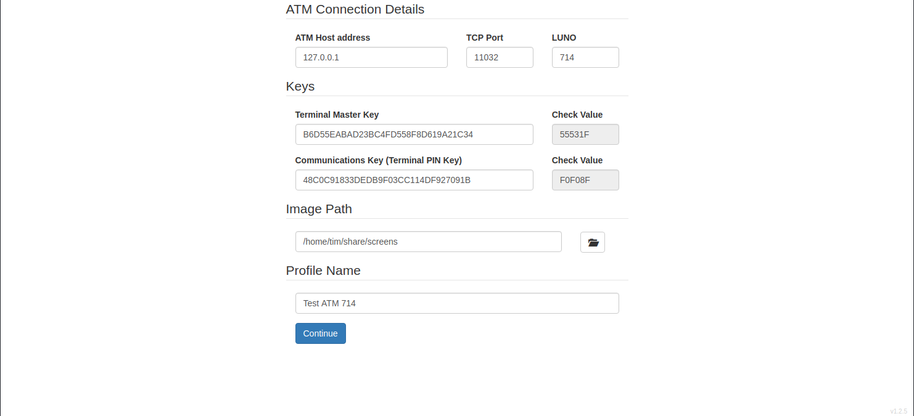
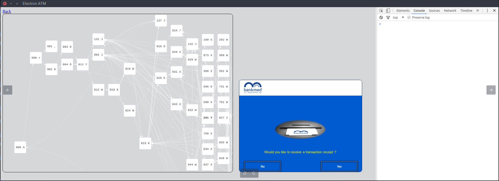
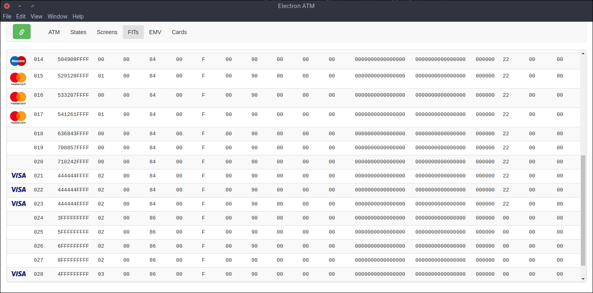
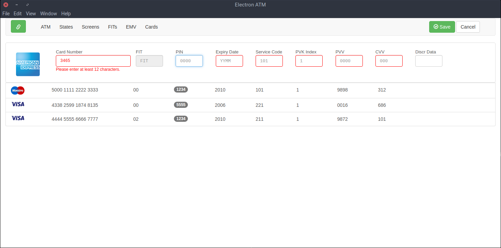

# electron-atm


[](https://codeclimate.com/github/timgabets/electron-atm/maintainability)
[](https://codeclimate.com/github/timgabets/electron-atm/test_coverage)

A simple free open-source [APTRA™ Advance NDC](https://www.ncr.com/financial-services/banking-atm-software/aptra-advance-ndc) ATM emulator, written from scratch using JavaScript, [visjs](http://visjs.org/), jQuery and [Electron](https://electron.atom.io/) framework.

Profile selection on application start:


ATM tab:


States tab:


Financial Institutions tab:


Cards management tab:


## To Use

To clone and run this repository you'll need [Git](https://git-scm.com) and [Node.js version 8.x](https://nodejs.org/en/download/) (which comes with [npm](http://npmjs.com)) installed on your computer. From the command line:

```bash
# Clone this repository
git clone https://github.com/timgabets/electron-atm
# Go into the repository
cd electron-atm
# Install dependencies
npm install
# Check the test cases
npm test
# Run the app
npm start
```

## Reasons of why this application was developed

Some reasons for the appearance of this application are described [here](http://gabets.ru/electron-atm).

## Features 

This is a side project of my full-time job and only the features that I currently need in my everyday work are implemented. 

Currently only the basic stuff is working, such as:

 * Connecting to ATM host
 * Showing ATM connection status icon (Offline, Connected, Out-Of-service, In-Service)
 * Moving through almost all the basic states (ICC states are passed through as well)
 * Showing basic image screens linked to the state
 * Checking the Card's financial institution based on FIT tables
 * Keyboard shortcuts: FDK (A-I), numeric(0-9), Esc, Enter and Backspace
 * Receiving and processing states, screens and FITs (financial insitution tables) from host
 * Showing traces in a log area
 * Saving ATM configuration data (such as states, screens, FITs, ConfigID, counters etc) and restoring it on application start
 * Showing dynamic on-screen data received from host
 * Crypto support: PIN block encryption, dynamic key exchange etc. (Triple DES double length key only)
 * State Navigator: showing graph of states
 * State Navigator: updating screen image when jumping through the states
 * State Navigator: displaying state details when state selected
 * FITs: showing a table of Financial Institutions
 * Saving the image path in user settings

Things to be implemented (very) soon:
 * Touch area support (pressing touch areas, not only FDK buttons)
 * Auto reconnection
 * ICC support


## FAQ

### What is this about?

This is an implementation of ATM (Automatic Teller machine) simulator, working under [APTRA™ Advance NDC](https://www.ncr.com/financial-services/banking-atm-software/aptra-advance-ndc) protocol.

### And why may I need it?

If you are working with ATM processing systems (a.k.a ATM Host - the systems to which ATMs are connected, and which process various messages from ATMs, including financial inquiries) - either developing applications or supporting them, you may need to emulate the ATM messages coming to the host. You're lucky if you have a real ATM nearby, but the chances are that your test ATM may be located on the other floor, or, the company that you're currently working in may not have a real ATM at all. Being fed up with closed-source self-written ATM-simulators, I decided to develop my own stable featureful open-source ATM simulator, which may be available to everyone in the Banking/Card processing community.

### The application is ugly.

Yes, I know and I'm really sorry. I'm not a frontend developer (I'm not even a web-developer  as my daytime job is related to soft-realtime payment processing, and my native language is C). Obviously, I'm not good at CSS at all, so, if you are strong enough in UI/UX, please, feel free to do something with [this](https://github.com/timgabets/electron-atm/blob/master/css/styles.css). And [that](https://github.com/timgabets/electron-atm/blob/master/index.html). And [that](https://github.com/timgabets/electron-atm/tree/master/templates) as well.

### jQuery? Why not [React](https://facebook.github.io/react/)?

To me, [React](https://facebook.github.io/react/) is good for building user-interface-specific applications, while this application is considered as backend-centric (i.e. having tons of the protocol-specific code in the backend). As always, it started as a simple Electron app with "just a little jQuery", but now it's a [whole mess](https://github.com/timgabets/electron-atm/blob/master/src/listeners/window.js) of event-handlers and SetInterval functions, that already need to be rewritten. So, if you're brave enough to redesign it all using React, please send me a pull request! ;)


### Why not ES6? 
I thought of ES6 in the very beginning, but Electron does not support ES6 out of the box, and transpiling with [Babel](https://babeljs.io/) looked as a complete overdesign to me. Again, if you would like to have ES6 in this application, just send me a pull request.


### I would like to use the application, but it seems that the feature X that I really need is not yet implemented.
As I said, only the features that I needed were implemented. For example, all the ATM configurations that I've been working with don't have V-type states (Language select from a card), therefore, these states are not supported by the application. So, if there is a feature that you would like to have implemented, you may create an [issue](https://github.com/timgabets/electron-atm/issues), or just drop me an [email](mailto:tim@gabets.ru). 


## Issues

Please feel free to submit [issues](https://github.com/timgabets/electron-atm/issues) and enhancement requests, or simply drop me an [email](mailto:tim@gabets.ru) if you want to participate in the project or just give some feedback.

## Contribute

Contributions are welcome, I would appreciate any help in application testing and development ;)

## License
[LGPLv2](LICENSE.md)


