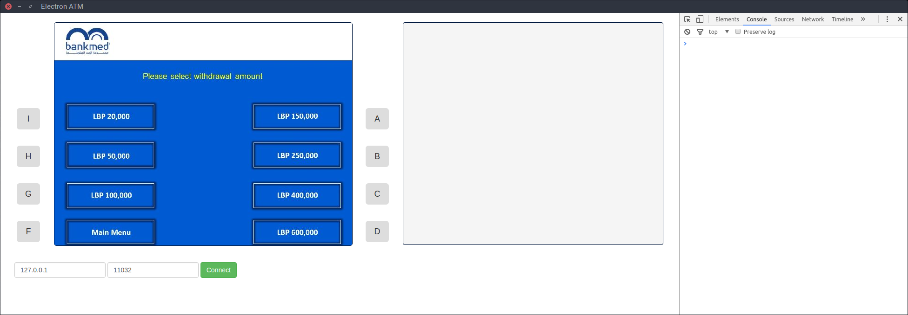

# electron-atm

A simple free open-source APTRA™ Advance NDC ATM emulator, written from scratch using, JavaScript, jQuery and Electron framework.

## Features 

This is a side project of my full-time job and only the features that I currently need in my everyday work are implemented. 

Currently only the basic stuff is working, such as:

 * Connecting to ATM host
 * Receiving states from host
 * Receiving screens from host
 * Receiving FITs (financial insitution tables) from host
 * Showing traces in a log area
 * Saving ATM configuration data (such as states, screens and FITs) and restoring it on application start

Things to be implemented soon:

 * Card events processing
 * State processing (moving through the states)
 * Linking screens and states
 * Crypto support (PIN block encryption and key exchange)
 * ICC support
 * States structure visualisation tool (probably using wis.js)

## Issues

Please feel free to submit issues and enhancement requests.

## Contribute

Contributions welcome!

## License
[LGPLv2](LICENSE.md)
